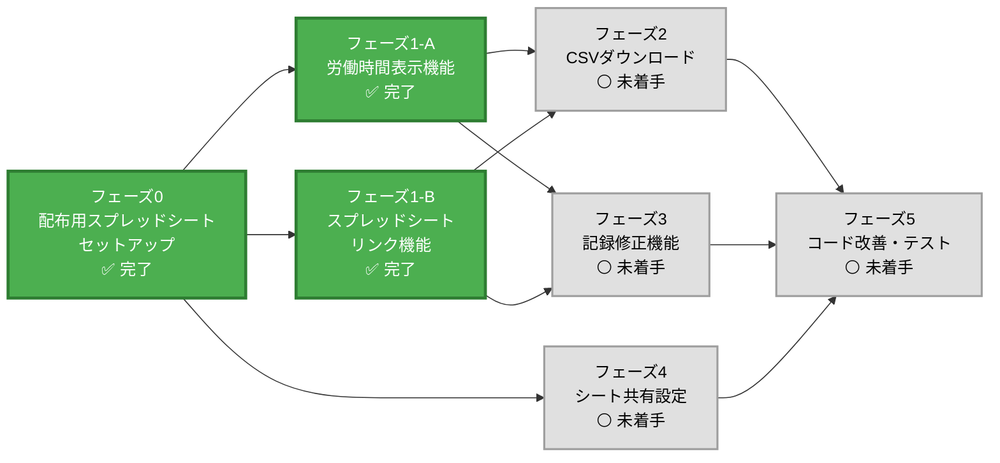
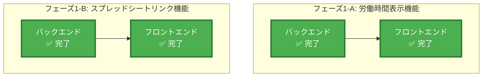

# 勤怠管理アプリ - To-Doリスト

## 概要
シートをみんなに配れる形にし、WEBアプリをアップデートする

## タスク依存関係図（マーメイドチャート）

### 凡例
- 🟢 **完了**: フェーズ0、フェーズ1-A、フェーズ1-B（完了）
- ⚪ **未着手**: フェーズ2〜5
- 🟡 **低優先度**: 記述修正（フェーズ5で対応予定）

### 現在の進捗状況
- **フェーズ0**: 完了 ✅
  - よくある質問シート作成機能追加済み
  - clasp設定更新・プッシュ完了
  - 動作確認完了（全ての項目で問題なく動作）
  - 既知の問題: 使用方法・よくある質問・設定方法シートの記述に不正確な部分あり（低優先度で後日修正予定）
- **フェーズ1**: 完了 ✅
  - **フェーズ1-A（労働時間表示機能）**: 完了 ✅
    - 労働時間計算機能実装完了（開始時刻・終了時刻・休憩時間を考慮）
    - 今月の総労働時間表示機能実装完了
    - フロントエンドUI追加完了（ページ読み込み時と出勤・退勤記録後に自動更新）
  - **フェーズ1-B（スプレッドシートリンク機能）**: 完了 ✅
- **フェーズ2**: 未着手（フェーズ1完了後に開始可能）
- **フェーズ3**: 未着手（フェーズ1完了後に開始可能）
- **フェーズ4**: 未着手（フェーズ0完了後、いつでも開始可能）
- **フェーズ5**: 未着手（全機能実装後に開始）

### 実行フロー
1. **フェーズ0** 完了後 →
2. **フェーズ1-A** と **フェーズ1-B** を並列実行（**フェーズ4**も並列実行可能）→
3. **フェーズ1**完了後 → **フェーズ2** と **フェーズ3** を開始可能 →
4. 全機能実装後 → **フェーズ5** を開始

## 実装フェーズ（依存関係順）

<strong>フェーズ0: 配布用スプレッドシートのセットアップ（最優先）✅ 完了</strong>

**依存関係**: なし（全機能の前提条件）

**目的**: GASを触ったことがない人でも使える配布用スプレッドシートを作成

**タスク**
- [x] 新しいスプレッドシートを作成（配布用）
- [x] 既存のGASコードを新しいスプレッドシートにコピー
- [x] 既存の月次シート（2025年9月、2025年10月など）を削除
- [x] 「設定方法」シートを作成（GASの設定手順、スプレッドシートIDの設定方法など）
- [x] 「使用方法」シートを作成（アプリの使い方、出勤・退勤の記録方法など）
- [x] 「よくある質問（FAQ）」シートを作成（初期設定に追加済み）
- [x] Code.gsの`SPREADSHEET_ID`を新しいスプレッドシートのIDに更新（スクリプトプロパティで自動取得に変更済み）
- [x] clasp設定を更新（スクリプトID: 11B0i63au0ejZqhoFgun2ftKtMLV1i7aqK49uQKND-y26BGSsFmMBFtXO）
- [x] clasp pushを実行（Code.gsとappsscript.jsonをプッシュ済み）
- [x] 新しいスプレッドシートで動作確認（完了）
- [x] 配布用スプレッドシートのIDをドキュメント化（ID: 1k7-ye74rdU3ZRvxQRChjdofcNwSBPdJa76jhtRvicac）

**注意事項**
- 配布用スプレッドシートで開発を進める（既存のスプレッドシートは開発用として残す）
- 設定方法・使用方法シートは、GAS初心者でも理解できるように詳細に記載
- スクリーンショットや図解を活用すると理解しやすい

**実装済み機能**
- onOpen関数でメニューに「初期設定をする」ボタンを追加
- 初期設定ボタンで「設定方法」「使用方法」「よくある質問」シートを自動生成
- 設定方法シート：スプレッドシートID設定（自動設定）、Webアプリデプロイ、動作確認の手順を記載
- 使用方法シート：①シートを出す、②出勤記録、③退勤記録、④複数回業務、⑤確認方法を記載
- よくある質問シート：15個のQ&Aをカテゴリ別に整理（基本操作、月次シート、Webアプリ、データ管理、その他）
- スクリプトプロパティを使用してスプレッドシートIDを自動取得・設定
- clasp設定を更新して新しいスクリプトIDに接続

**動作確認手順**
1. **新しいスプレッドシートでGASコードをコピー**
   - 配布用スプレッドシート（ID: 1k7-ye74rdU3ZRvxQRChjdofcNwSBPdJa76jhtRvicac）を開く
   - 「拡張機能」→「Apps Script」を選択
   - Code.gsの内容をコピーして新しいスプレッドシートのApps Scriptに貼り付け
   - 保存（💾）

2. **初期設定を実行**
   - 新しいスプレッドシートを開く
   - 上部メニューから「⚙️ 勤怠管理」→「🔧 初期設定をする」を選択
   - 「設定方法」「使用方法」「よくある質問」シートが作成されることを確認
   - スプレッドシートIDが自動設定されることを確認

3. **Webアプリとしてデプロイ**
   - Apps Scriptエディタで「デプロイ」→「新しいデプロイ」を選択
   - 種類の選択で「ウェブアプリ」を選択
   - 「次のユーザーとして実行」を「自分」に設定
   - 「アクセスできるユーザー」を「全員」に設定
   - 「デプロイ」ボタンをクリック
   - WebアプリのURLをコピーして保存

4. **出勤・退勤機能の動作確認**
   - WebアプリのURLにアクセス
   - 「出勤」ボタンをクリックして出勤時刻が記録されることを確認
   - 業務内容を入力して「退勤」ボタンをクリック
   - 退勤時刻と業務内容が記録されることを確認
   - スプレッドシートで該当月のシート（例: 2025年11月）にデータが記録されていることを確認

5. **月次シートの自動生成確認**
   - 新しい月の出勤記録を行う（または日付を変更してテスト）
   - 新しい月のシートが自動的に作成されることを確認
   - シート名が「YYYY年M月」形式であることを確認

6. **エラーハンドリングの確認**
   - スプレッドシートIDが正しく設定されているか確認（メニューから「📊 スプレッドシート接続テスト」を実行）
   - エラーが発生しないことを確認

**確認項目チェックリスト**
- [x] 初期設定ボタンで3つのシート（設定方法、使用方法、よくある質問）が作成される ✅
- [x] スプレッドシートIDが自動設定される ✅
- [x] Webアプリが正常にデプロイできる ✅
- [x] 出勤記録が正常に動作する ✅
- [x] 退勤記録が正常に動作する ✅
- [x] 月次シートが自動生成される ✅
- [x] データが正しくスプレッドシートに記録される ✅

**動作確認結果**: 全ての項目で問題なく動作を確認 ✅

**既知の問題・改善点**:
- 使用方法、よくある質問、設定方法シートに不正確な記述がある（後で修正予定、低優先度）

---

### フェーズ1: 高優先度機能（並列実行可能）

#### タスクグループA: 今月の労働時間表示機能 ✅ 完了
**依存関係**: なし（独立実装可能）

**バックエンド（GAS）**
- [x] 開始時刻と終了時刻から労働時間を計算するロジックを実装（`calculateWorkHours()`）
- [x] 休憩時間を考慮した実労働時間の計算ロジックを実装
- [x] 今月の総労働時間を計算する関数を追加（`getMonthlyWorkHours()`）
- [x] 時間単位での表示形式変換関数を実装（例: "120時間30分"）

**フロントエンド（HTML/JS）**
- [x] 今月の労働時間を表示するUIセクションを追加
- [x] 労働時間を取得して表示する関数を実装
- [x] ページ読み込み時に労働時間を自動取得・表示

#### タスクグループB: スプレッドシートへのリンク機能 ✅ 完了
**依存関係**: なし（独立実装可能）

**バックエンド（GAS）**
- [x] スプレッドシートのURLを取得する関数を追加（`getSpreadsheetUrl()`） ✅

**フロントエンド（HTML/JS）**
- [x] 「スプレッドシートを開く」ボタンを追加 ✅
- [x] 新しいタブでスプレッドシートを開く機能を実装 ✅
- [x] ボタンのスタイリングと配置 ✅

---

### フェーズ2: CSVダウンロード機能
**依存関係**: フェーズ1完了後（独立実装可能）

**バックエンド（GAS）**
- [ ] 利用可能なシート一覧を取得する関数を追加（`getAvailableSheets()`）
- [ ] 選択したシートのデータを取得する関数を追加（`getSheetData()`）
- [ ] CSV形式に変換する関数を実装（`convertToCSV()`）
- [ ] CSVダウンロード用のエンドポイントを追加（`downloadCSV()`）

**フロントエンド（HTML/JS）**
- [ ] シート選択UI（ドロップダウン）を追加
- [ ] CSVダウンロードボタンを追加
- [ ] ダウンロード処理の実装（ファイル名: "2025年11月_勤怠記録.csv"）
- [ ] エラーハンドリングとローディング表示

---

### フェーズ3: 記録修正機能
**依存関係**: フェーズ1完了後（独立実装可能）

**バックエンド（GAS）**
- [ ] 記録一覧を取得する関数を追加（`getAllRecords()`）
- [ ] 特定の記録を更新する関数を実装（`updateRecord()`）
- [ ] 記録を削除する関数を実装（`deleteRecord()`）
- [ ] バリデーション関数を実装（日付、時刻の妥当性チェック）

**フロントエンド（HTML/JS）**
- [ ] 記録一覧表示UIを追加（テーブル形式）
- [ ] 編集ボタンと削除ボタンを追加
- [ ] 編集用のモーダルまたはフォームを実装
- [ ] フォームのバリデーション機能を追加
- [ ] 確認ダイアログ（削除時）を実装

---

### フェーズ4: シート共有設定・配布準備
**依存関係**: フェーズ0完了後（いつでも実装可能、並列実行可能）

- [ ] スプレッドシートの共有設定を確認・調整
- [ ] アクセス権限の設定方法を「設定方法」シートに追記
- [ ] 複数ユーザーでの利用を想定した設計の確認
- [ ] 配布用テンプレートの最終確認
- [ ] 配布時の注意事項をドキュメント化

---

### フェーズ5: コード改善・テスト・ドキュメント
**依存関係**: 全機能実装後

**コード改善**
- [ ] エラーハンドリングの強化
- [ ] ログ出力の整理
- [ ] コードのコメント追加
- [ ] 関数のリファクタリング（必要に応じて）

**テスト**
- [ ] 各機能の動作確認
- [ ] 複数ユーザーでの動作確認
- [ ] エラーケースのテスト

**ドキュメント**
- [ ] README.mdの更新
- [ ] 使用方法のドキュメント作成
- [ ] セットアップ手順の更新

## 並列実行可能なタスク

### フェーズ1の内部構造（各グループ内の依存関係）

**並列実行可能な組み合わせ**:
- **フェーズ1-A（バックエンド）** と **フェーズ1-B（バックエンド）** は並列実行可能
- **フェーズ1-A（フロントエンド）** と **フェーズ1-B（フロントエンド）** は並列実行可能
- **フェーズ4（シート共有設定）** はフェーズ1と並列実行可能

### 依存関係があるタスク
- **フェーズ0（配布用スプレッドシートセットアップ）は最優先で実装** ✅ ほぼ完了
- フェーズ1以降はフェーズ0完了後に実装開始
- 各フェーズ内のバックエンド → フロントエンドの順序で実装
- フェーズ2、3はフェーズ1完了後に実装開始可能

## 優先順位

0. **最優先（フェーズ0）**
   - 配布用スプレッドシートのセットアップ
   - 設定方法・使用方法シートの作成

1. **高優先度（フェーズ1）**
   - 今月の労働時間表示機能
   - スプレッドシートへのリンク機能

2. **中優先度（フェーズ2、3）**
   - CSVダウンロード機能
   - 記録修正機能

3. **低優先度（フェーズ4、5）**
   - シート共有設定・配布準備
   - コード改善
   - ドキュメント更新

## 注意事項

- スプレッドシートIDは環境変数または設定ファイルで管理することを検討
- セキュリティを考慮したアクセス制御の実装
- データの整合性を保つためのバリデーション強化
- 各フェーズ完了時にコミット・プッシュを推奨

